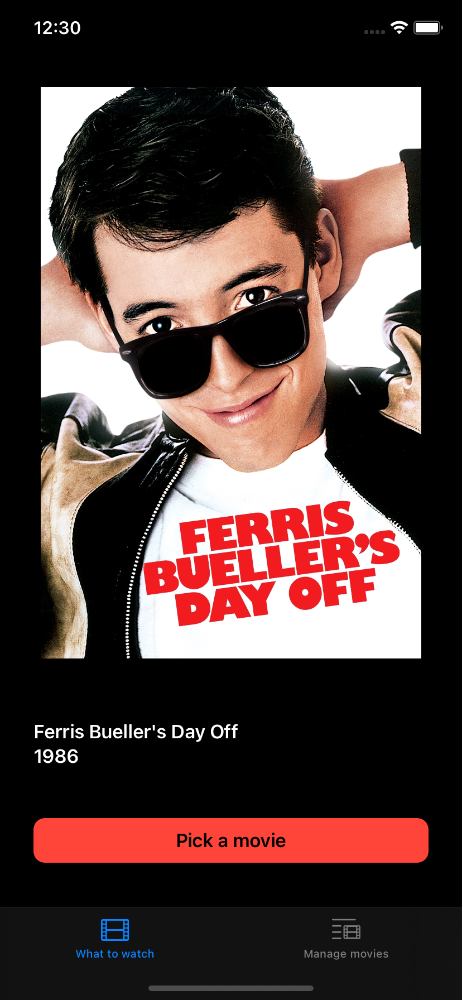
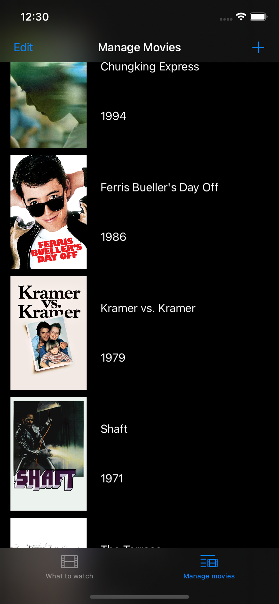
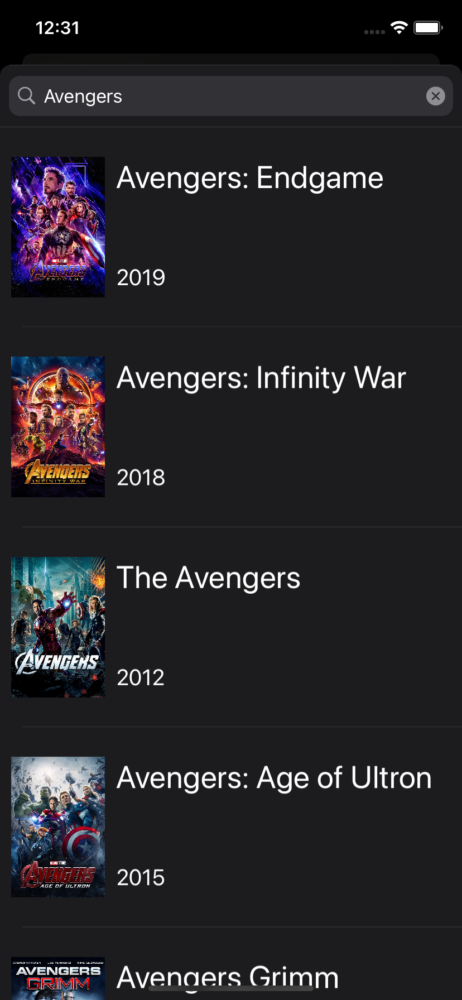
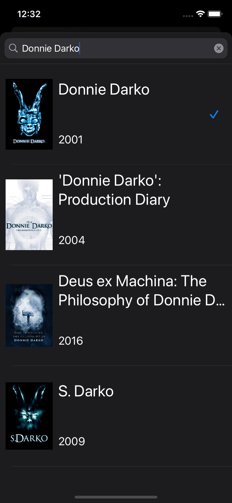

# MovieQueue

 &nbsp;  &nbsp;  &nbsp; 

MovieQueue is a simple app that lets you manage a list of movies to watch and randomly pick one from your list for those nights when you can’t decide.
You can either add movies by searching for titles in any language thanks to the TMDb (The Movie Database) integration or manually add entries by filling in the movie title, year, and providing the movie poster from you photo library.

* Built in Swift and Storyboards using Auto Layout
* Shows usage of: Table Views with custom cells, URL queries and Codable for matching a JSON response to a custom model, ImagePicker, Grand Central Dispatch for background download of pictures and updating Table View Cells on demand
* No external libraries are used
* No data is collected, database is stored locally and internet connectivity is only used for TMDb queries
